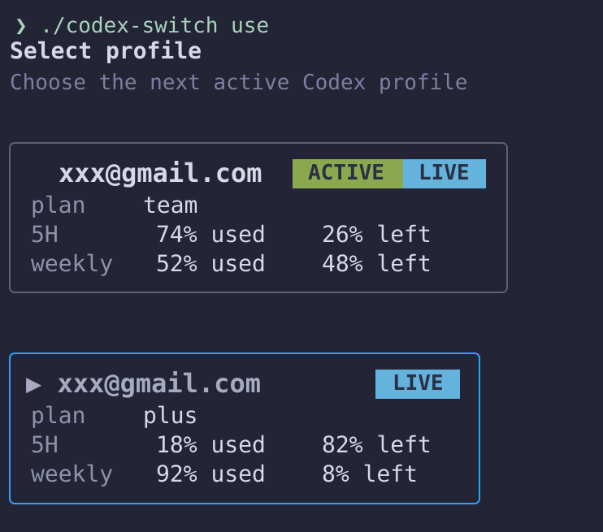
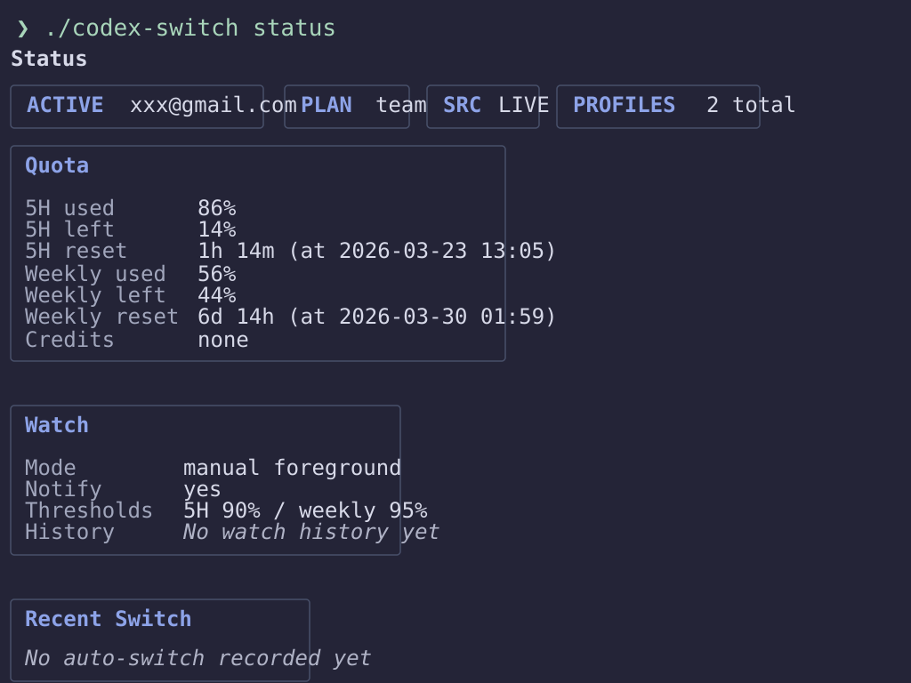

<div align="center">

# codex-switch

### Switch Codex CLI accounts without manually tearing down your session every time

</div>

---

> [!IMPORTANT]
> `codex-switch` stores copied OAuth profile files under `~/.codex-switch/profiles/` and updates `~/.codex/auth.json` when you run `use` or when `watch` auto-switches.
>
> It makes network calls to `chatgpt.com` for quota checks, `auth.openai.com` for token refresh, and can trigger local desktop notifications when `watch.notify = true`.
>
> To stop it immediately, end the foreground `watch` process. To undo it, switch back to another saved profile or restore `~/.codex/auth.json` manually. To uninstall, delete the built binary and remove `~/.codex-switch/`.

## The Problem

If you use multiple ChatGPT Plus accounts with Codex CLI, switching between them is awkward: you cannot see each account's remaining quota in one place, and changing accounts usually means manually replacing the active auth state.

`codex-switch` keeps per-account auth snapshots, shows current quota usage, and can switch `~/.codex/auth.json` to a better account when the current one is nearly depleted.

## Build

```bash
git clone <your-repo-url> codex-switch
cd codex-switch
go build ./cmd/codex-switch
```

## See It Work

```text
$ ./codex-switch auth --login work
warning: codex logout and codex login will run now
saved profile: work

$ ./codex-switch auth --login personal
warning: codex logout and codex login will run now
saved profile: personal

$ ./codex-switch list
NAME      PLAN   5H USED   5H LEFT   WEEKLY USED   WEEKLY LEFT   5H RESET   WEEKLY RESET   SRC    ACTIVE
personal  plus   8%        92%       12%           88%           4h 50m     5d 2h         live
work      plus   22%       78%       61%           39%           1h 10m     2d 6h         live   *

$ ./codex-switch use personal
active profile: personal

$ ./codex-switch status
Status
╭───────────────╮ ╭───────────╮ ╭──────────╮ ╭──────────────────╮
│ ACTIVE work   │ │ PLAN plus │ │ SRC LIVE │ │ PROFILES 2 total │
╰───────────────╯ ╰───────────╯ ╰──────────╯ ╰──────────────────╯

╭────────────────────────────────────────────╮
│ Quota                                      │
│                                            │
│ 5H used       8%                           │
│ 5H left       92%                          │
│ 5H reset      4h 50m (at 2026-03-23 14:31) │
│ Weekly used   12%                          │
│ Weekly left   88%                          │
│ Weekly reset  5d 2h (at 2026-03-28 18:42)  │
│ Credits       none                         │
╰────────────────────────────────────────────╯

╭──────────────────────────────────╮
│ Watch                            │
│                                  │
│ Mode        manual foreground    │
│ Notify      yes                  │
│ Thresholds  5H 90% / weekly 95%  │
│ History     No watch history yet │
╰──────────────────────────────────╯

╭─────────────────────────────╮
│ Recent Switch               │
│                             │
│ No auto-switch recorded yet │
╰─────────────────────────────╯

╭───────────────────────────╮
│ Profiles                  │
│                           │
│ Current      work         │
│ Previous     -            │
│ Saved        2 total      │
│ Auto check   on           │
│ Check model  gpt-5.4-mini │
╰───────────────────────────╯
```

### Screenshots

Interactive profile selector (redacted):



Status dashboard (redacted):



## Commands

```text
auth <name>          Save the current auth profile or import one with --login
list [--no-check]    Show saved profiles and quota usage
use [name]           Activate a saved profile or open the selector
status [--no-check]  Show active profile, quota, and watch summary
remove <name>        Remove a saved profile
watch                Watch quota usage and switch automatically
```

## Getting Started

1. Run `./codex-switch auth --login <name>` to sign in and save a new account.
2. Run `./codex-switch auth <name>` if you only want to save the account already active in `~/.codex/auth.json`.
3. Use `./codex-switch list` to compare usage across accounts.
4. Use `./codex-switch use` to pick a profile interactively, or `./codex-switch use <name>` to switch directly.
5. Run `./codex-switch watch` if you want foreground auto-switching based on your configured thresholds.

## Configuration

Profiles and config live under `~/.codex-switch/`.

```toml
check_model = "gpt-5.4-mini"
active_profile = ""
auto_check = true

[watch]
primary_threshold_percent = 90
secondary_threshold_percent = 95
notify = true
```

`auto_check = true` is the default, so `list` and `status` try to fetch fresh quota data unless you disable it in config. `--no-check` forces cache-only output for that invocation.
`watch` no longer uses fixed interval polling. Existing `interval_minutes` values in older configs can be left in place, but they are ignored by the event-driven watcher.

## How It Works

`codex-switch` does not proxy Codex CLI. It works by managing multiple copies of Codex's OAuth auth file, then atomically writing the chosen profile into `~/.codex/auth.json`.

<details>
<summary><b>Details</b> — storage, quota checks, and switching</summary>

- Saved profiles are stored as raw JSON copies in `~/.codex-switch/profiles/<name>.json`.
- Quota checks use `POST https://chatgpt.com/backend-api/codex/responses` and read codex quota headers from the response.
- If a quota check returns `401`, the refresh flow can request new tokens from `https://auth.openai.com/oauth/token` and rewrite the stored profile JSON with updated tokens.
- `watch` performs one startup calibration, then watches local Codex session files under `~/.codex/sessions/`.
- When a local `token_count` event shows threshold pressure, `watch` confirms the active profile with a direct quota probe before checking saved candidates.
- `watch` only switches when another saved profile has lower weekly usage.
- `watch` stores runtime state in `~/.codex-switch/watch-state.toml` and retains `watch-checks.jsonl` and `watch.log` for 7 days.

</details>

## Reference

- `auth --login` temporarily runs `codex logout` and `codex login`, then restores the original `~/.codex/auth.json`.
- Plain `auth` saves the account already present in `~/.codex/auth.json`; if no current session exists, it tells you to use `auth --login`.
- `use` without a profile name opens an inline Bubble Tea selector with arrow keys or `j`/`k`; `use <name>` keeps the non-interactive path for scripts.
- `list`, the `use` selector, and the `status` summary bar all show `SRC`. `SRC LIVE` means the quota data came from a fresh network check; `SRC CACHE` means it came from the local cache in `~/.codex-switch/config.toml`.
- `list --no-check` and `status --no-check` read cached quota data from `~/.codex-switch/config.toml`.
- `status` renders a compact terminal dashboard with a summary bar plus `Quota`, `Watch`, `Recent Switch`, and `Profiles` cards.
- `remove <name>` refuses to delete the active profile unless you pass `--force`.
- `watch` is event-driven: it does one startup calibration, then reacts to local Codex session events instead of fixed-interval quota polling.

## FAQ

**Does this replace Codex CLI?**  
No. It only manages auth state and quota checks around the existing CLI.

**Does `watch` run as a daemon?**  
No. It runs in the foreground. Use your own process manager if you want it supervised.

**Can it use API-key auth instead of ChatGPT OAuth?**  
No. This project is scoped to the ChatGPT OAuth flow used by Codex CLI.
